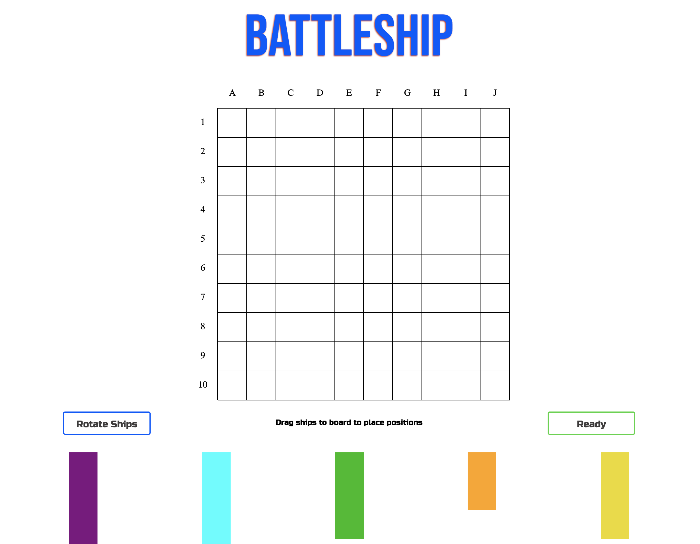

# Battleship-Game

Deployed: https://phoenix-99hp.github.io/Battleship-Game/

This is a battleship game that I made while following the Odin Project's Curriculum.

Upon clicking the "Start" button, the user will be instructed to drag their ships to positions on an empty board. The user is provided with a "Rotate" button that allows them to switch between vertical and horizontal orientations for their ships. If the user accidentally places the ship in a position that they didn't intend, they can simply continue dragging the ship on the board, or, if they wish to change the ship's orientation, they can drag the ship back to the starting area and rotate it. Once the user is ready to begin the game they can click the "Ready" button.

Once the "Ready" button is clicked, the user will be presented with two boards, one board showing their ship placements and the computer's moves, and the other board contains the computer's ships and appears empty until the user clicks a square to make a move. The game ends when the user hits all of the computer's ships, or vice versa. The computer is programmed to make random guesses until it receives a "Hit". Then, it is programmed to make guesses that are close to that hit.

